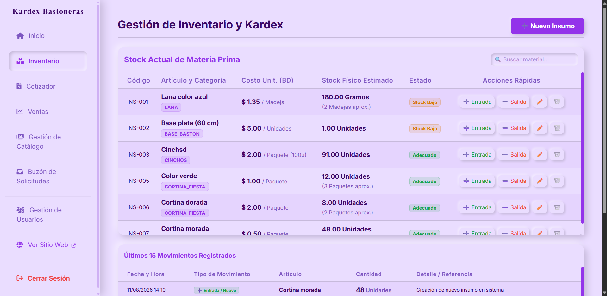
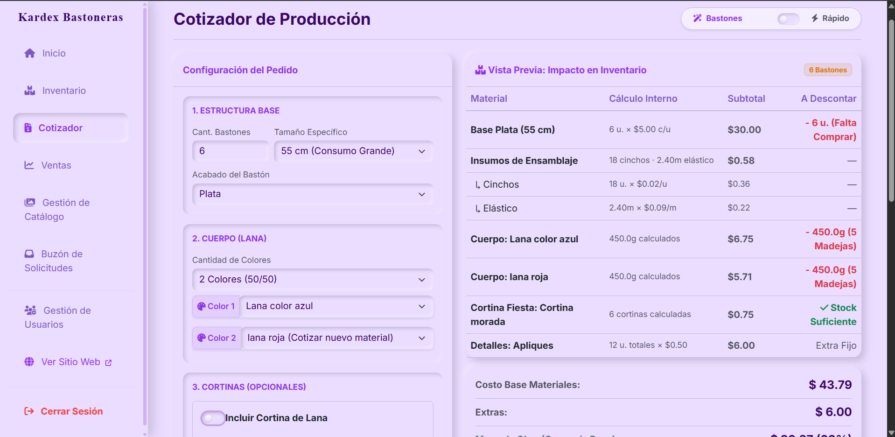
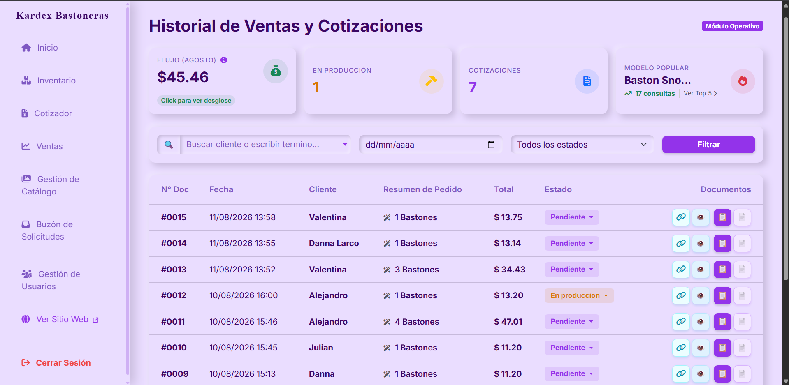
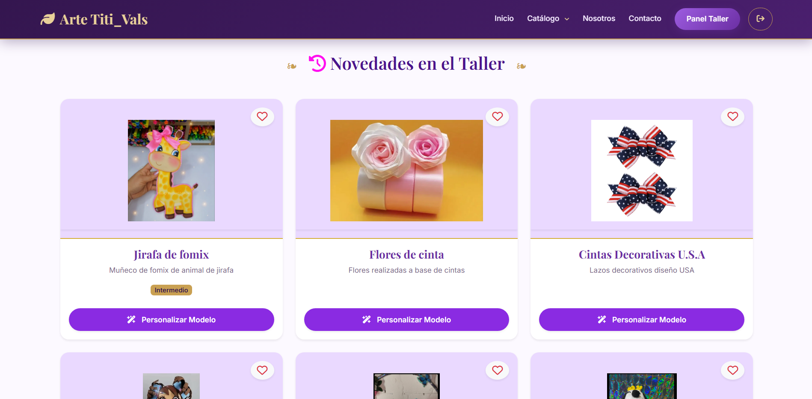

# Sistema ERP & Cotizador BTO — Taller Arte Titi_Val

Plataforma web integral bajo modelo Built-to-Order (BTO) para la gestión operativa y manufactura a medida de bastones institucionales. Centraliza desde el catálogo público de captación y el cotizador reactivo hasta el control de inventario (Kardex) y el módulo de despacho.

---

## Contexto y reto de negocio

El taller operaba con estimaciones empíricas de insumos (lana, elásticos, bases pre-cortadas), sin trazabilidad de mermas ni control digital de inventario. Esto derivaba en paros imprevistos de producción y presupuestos inexactos.

**Solución:** un sistema web desacoplado en dos capas:

- **Capa pública / BTO:** catálogo dinámico que genera prospectos sin exponer la lógica de costos ni los márgenes del taller.
- **Capa ERP interna:** panel administrativo con motor de cálculo reactivo, control de inventario en unidades mínimas de consumo (gramos/unidades) y módulo de despacho con tolerancia a fallos.

---

## Stack tecnológico

- **Backend:** PHP 8.x / Laravel (MVC, Eloquent ORM)
- **Base de datos:** MySQL (InnoDB, transacciones ACID, Soft Deletes)
- **Frontend:** Blade, JavaScript ES6 modular (Vite), Bootstrap 5
- **Componentes UI:** Select2 (AJAX), SweetAlert2, Fetch API
- **Utilidades:** barryvdh/laravel-dompdf, Compressor.js

---

## Decisiones arquitectónicas clave

### Desacoplamiento MRP
El cotizador y el guardado de pedidos operan como una reserva matemática. El descuento físico en bodega solo se ejecuta de forma transaccional (`DB::beginTransaction`) cuando el pedido pasa a estado "Realizado/Despachado".

### Doble perímetro de seguridad
Aislamiento total mediante middlewares por rol (`admin` / `cliente`). Los clientes acceden a su historial de proformas sin acceso a endpoints internos de costos, inventario o fórmulas de producción.

### Despacho resiliente (deuda de inventario)
Algoritmo de búsqueda inteligente (`LIKE` y mapeo por categoría) que tolera variaciones de nomenclatura. Si el stock físico es insuficiente, el sistema permite saldos negativos controlados y emite alertas visuales sin frenar la logística.

### Modularización frontend (SoC)
El formulario de cotización se refactorizó de un archivo monolítico a módulos ES6 independientes (`modulo_lana.js`, `modulo_cortinas.js`, `modulo_decoracion.js`, `modulo_diseno.js`) orquestados por un script principal y optimizados con Vite.

---

## Módulos del sistema

| Módulo | Responsabilidad |
|--------|-----------------|
| Kardex | Registro continuo de entradas/salidas en unidad mínima. Motor traductor visual (madejas/rollos en UI, gramos/metros en BD). |
| Cotizador | Motor de cálculo reactivo con costeo fraccional, reglas de mayoreo y blindaje contra race conditions (doble clic). |
| Puente BTO | Sincronización bidireccional entre solicitudes web (`quote_requests`) y órdenes de producción (`pedidos`). |
| Historial y despacho | Vista rápida asíncrona, trazabilidad de estados y generación de recetas de compra por déficit real de stock. |
| Catálogo y reseñas | Landing con carga perezosa de imágenes, sistema de calificación AJAX e integración con WhatsApp. |
| Alertas y KPIs | Detección de materiales huérfanos y resolución de inventario en 1 clic desde el panel principal. |

---

## Capturas

| Kardex / Inventario | Cotizador Reactivo |
| :---: | :---: |
| *Trazabilidad de insumos en tiempo real* | *Cálculo de costos con costeo fraccional* |
|  |  |

| Panel de Control | Catálogo Público BTO |
| :---: | :---: |
| *KPIs, centro de alertas y gestión de ventas* | *Vitrinas interactivas y solicitudes de cotización* |
|  |  |

---

## Estado del proyecto

- **Versión:** 6.0
- **Estado:** funcional (en uso por el taller)
- **Próximo hito:** exportación de reportes en Excel y ampliación de KPIs
- **Documentación:** +30 páginas de bitácora técnica

---

## Instalación local

```bash
git clone https://github.com/Alej673/sistema-bastones.git
cd sistema-bastones
composer install
npm install
cp .env.example .env
php artisan key:generate
# configurar base de datos en .env
php artisan migrate --seed
npm run dev
php artisan serve
```

---

## Enlaces

- [Repositorio](URL)
- [Video demo](URL) *(próximamente)*

---

**Autor:** Alejandro Larco  
[GitHub](URL) · [LinkedIn](URL) · [Portafolio](URL)

*Proyecto de Integración Curricular (PTIC) — Titulación en Desarrollo de Software.*
